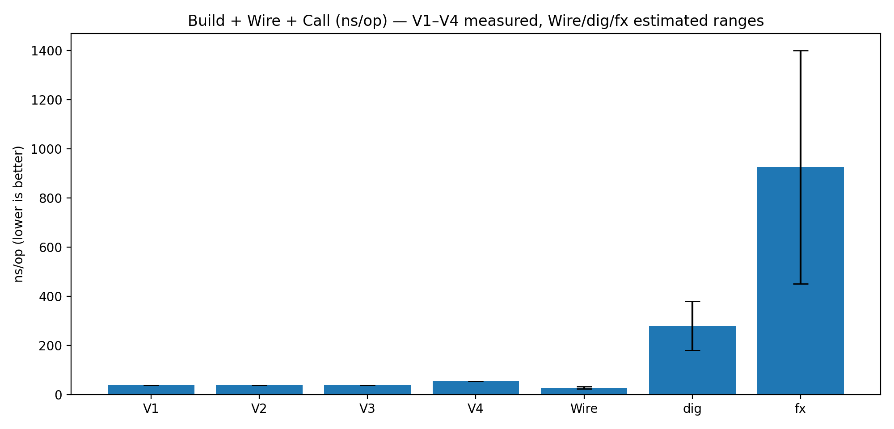
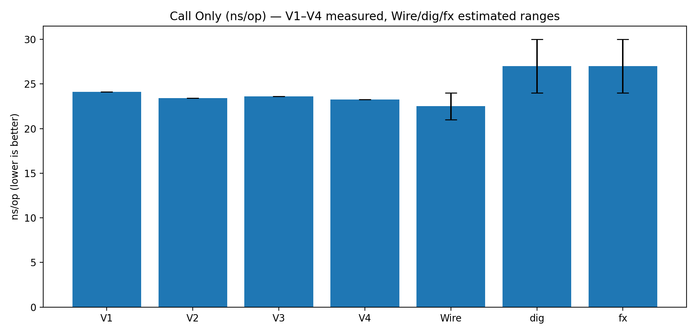

# odi
[](https://github.com/sghaida/odi/actions/workflows/ci.yml)
[](https://app.codacy.com/gh/sghaida/odi/dashboard?utm_source=gh&utm_medium=referral&utm_content=&utm_campaign=Badge_grade)
[](https://app.codacy.com/gh/sghaida/odi/dashboard?utm_source=gh&utm_medium=referral&utm_content=&utm_campaign=Badge_coverage)

Opinionated DI micro framework

# odi — Dependency Injection approaches (v1 → v4)

This repo explores a progression of **explicit** dependency injection patterns in Go — from a tiny runtime helper (v1), to pure manual wiring (v2), to code-generated builders (v3), and finally to code-generated builders **plus** composition roots and optional-deps registry (v4).

Each version is intentionally small and opinionated. Pick the one that matches your constraints.

---

## Quick navigation

### Versions (docs)

- **v1 — tiny generic DI helper (runtime injectors + dep bag)**
  - [Docs](docs/service-v1.md)
  - [Examples](examples/v1)

- **v2 — minimal construction only (no injectors, no dep tracking)**
  - [Docs](docs/service-v2.md)
  - [Examples](examples/v2)

- **v3 — code-generated facades/builders (di1)**
  - [Docs](docs/service-v3.md)
  - [Examples](examples/v3)

- **v4 — code-generated facades + graph composition roots (di2)**
  - [Docs](docs/service-v4.md)
  - [Examples](examples/v4)

> Tip: start with the examples first — they show the wiring style end-to-end.

---

## Which version should I use?

### v1 — Runtime injectors + dependency introspection
Use v1 when you want **explicit wiring** but also want guardrails and test-friendly introspection.

Best for:
- explicit wiring in `main`
- typed-ish errors for missing/wrong-type deps
- validating wiring in tests (`Has`, `GetAny`, `TryGetAs`, etc.)
- seeing “what was injected” via a dep bag

Docs & details:
- [Docs](docs/service-v1.md)
- Example walkthrough: [Examples](examples/v1)

---

### v2 — Construction only (manual wiring)
Use v2 when you want the simplest possible approach: constructors + plain struct wiring.

Best for:
- small services / CLIs / demo code
- codebases where Go constructors are enough
- zero DI concepts leaking into your service design

Docs & details:
- [Docs](docs/service-v2.md)
- Example walkthrough: [Examples](examples/v2)

---

### v3 — Codegen builders (di1)
Use v3 when manual wiring is getting noisy, but you still want wiring to stay **explicit** (no containers).

Best for:
- “explicit DI” with less boilerplate in `main`
- build-time validation that required deps were injected (`Build`)
- ergonomic, generated `InjectX(...)` methods
- teams that want a repeatable pattern across services

Docs & details:
- [Docs](docs/service-v3.md)
- Example walkthrough: [Examples](examples/v3)

---

### v4 — Codegen builders + registry + generated composition root (di2)
Use v4 when your app has many services and you want:
- clean composition root (generated graph function)
- optional dependencies via a small registry (`BuildWith(reg)`)
- per-method “requires” wrappers for safer calling
- explicit cycle wiring tools (`UnsafeImpl()`), without containers

Docs & details:
- [Docs](docs/service-v4.md)
- Example walkthrough: [Examples](examples/v4)

---

## Pros / Cons by version

### v1 — Tiny generic DI helper (runtime injectors + dep bag)
**Pros**
- Very explicit wiring, but with guardrails (duplicate key / missing dep / wrong type)
- Test-friendly introspection (`Deps`, `Has`, `GetAny`, `TryGetAs`)
- Good for experiments and “small but safe” bootstrap code
- Minimal runtime overhead (mostly map write + bind call)

**Cons**
- Still runtime validation (not compile-time)
- Dependency bag can be abused (becomes “hidden container” if overused)
- Optional deps require discipline (since everything is “injectable”)

---

### v2 — Minimal construction only (manual wiring)
**Pros**
- Most Go-idiomatic: constructors + struct fields
- Max simplicity: no keys, injectors, registry, specs, or codegen
- Strong compile-time typing (wiring is just normal Go code)
- Great for libraries, CLIs, demos

**Cons**
- No validation that required deps were wired (unless you add checks)
- Boilerplate grows quickly with graph size
- Optional/cross-cutting concerns (tracing/metrics/logging) can leak everywhere
- Cycles are painful and usually indicate refactoring (or two-phase init)

---

### v3 — Code-generated service facades/builders (di1)
**Pros**
- Keeps wiring explicit, but removes repetitive boilerplate
- Service-centric builder API: `NewX().InjectA(a).InjectB(b).Build()`
- Build-time guardrails (required deps validated by `Build()`)
- `Inject(fn)` hook handles optional wiring and one-off patterns cleanly
- Scales better than v1/v2 in “many services, many deps” repos

**Cons**
- Requires codegen + spec upkeep (`*.inject.json`)
- Still runtime validation (at `Build()` time)
- Cycles are supported but require explicit patterns (capture pointers, setters)

---

### v4 — Code-generated facades + optional registry + generated graph (di2)
**Pros**
- Scales best: generated composition root keeps `main` tiny and reviewable
- Required deps validated + optional deps resolved via registry (`BuildWith(reg)`)
- Per-method “requires” wrappers (safer calling surface)
- Explicit cycle wiring supported intentionally (`UnsafeImpl()` for composition root)
- Great for large graphs and multi-team consistency

**Cons**
- Requires both service specs + graph specs (two inputs)
- Slightly more mental model: “service builder” + “graph root”
- Manual wiring outside the composition root must follow the same rules

---

## Summary Table

This compares the repo approaches (v1–v4) with common Go DI libraries and “no framework”.

| Option / Library                       | Compile-Time Safety |     Cycles | Codegen | Runtime Container |            Optional Deps | Lifecycle Mgmt | Scalability | Typical Use                                   |
|----------------------------------------|--------------------:|-----------:|--------:|------------------:|-------------------------:|---------------:|------------:|-----------------------------------------------|
| **V1 – Runtime Injectors**             |                   ❌ |          ✅ |       ❌ |                 ❌ |     ✅ (injector pattern) |              ❌ |          ⚠️ | Small apps needing guardrails + introspection |
| **V2 – Manual constructors**           |                   ✅ |         ⚠️ |       ❌ |                 ❌ |                        ❌ |              ❌ |          ⚠️ | Small services, CLIs, libraries               |
| **V3 – Codegen Facade (di1)**          |     ⚠️ (Build-time) | ✅ (manual) |       ✅ |                 ❌ | ✅ (`Inject(fn)` pattern) |              ❌ |           ✅ | Medium services, reduce wiring noise          |
| **V4 – Facade + Graph (di2)**          |     ⚠️ (Build-time) |          ✅ |       ✅ |                 ❌ |  ✅ (registry + defaults) |              ❌ |         ⭐⭐⭐ | Large graphs, optional deps, cycles           |
| **Google Wire**                        |                   ✅ |          ❌ |       ✅ |                 ❌ |    ⚠️ (params/providers) |              ❌ |          ⭐⭐ | Static DAG apps, strong typing                |
| **uber-go/dig**                        |                   ❌ |         ⚠️ |       ❌ |                 ✅ |                        ✅ |              ❌ |          ⭐⭐ | Runtime wiring, prototyping                   |
| **uber-go/fx**                         |                   ❌ |         ⚠️ |       ❌ |                 ✅ |                        ✅ |              ✅ |         ⭐⭐⭐ | Long-running apps with lifecycle              |
| **sarulabs/di**                        |                   ❌ |         ⚠️ |       ❌ |                 ✅ |                        ✅ |             ⚠️ |          ⭐⭐ | Runtime container + scopes                    |
| **No framework (manual constructors)** |                   ✅ |          ❌ |       ❌ |                 ❌ |                        ❌ |              ❌ |          ⚠️ | Tiny codebases, libraries                     |

Legend:
- ⚠️ = partially supported / requires discipline or patterns
- ⭐ = relative scalability (maintainability as graph + teams grow)

---

## Recommendation Table

| Use Case / Constraint                           | Recommended                | Why                                                                        |
|-------------------------------------------------|----------------------------|----------------------------------------------------------------------------|
| Small library / SDK                             | **No framework** or **v2** | Keep deps explicit; minimal tooling; strong compile-time safety            |
| Small service, mostly acyclic                   | **Wire** or **v2**         | Direct constructor graph; minimal overhead                                 |
| Need introspection/testing assertions on wiring | **v1**                     | `Deps` bag + typed-ish DI errors + `TryGetAs` make assertions easy         |
| Medium service graph, want a clean builder API  | **v3**                     | Explicit DI + less boilerplate; `Build()` enforces required deps           |
| Large multi-service graph                       | **v4**                     | Generated composition root scales best; keeps `main` readable              |
| Cyclic dependencies present (A ↔ B)             | **v4** (or **v3**)         | Explicit cycle wiring patterns; `UnsafeImpl()` exists for composition root |
| Plugin / feature-flag heavy wiring              | **v1** or **dig**          | Late binding and runtime flexibility                                       |
| Need lifecycle (start/stop hooks)               | **fx**                     | Built-in lifecycle management for long-running apps                        |
| Need request/session scoping patterns           | **sarulabs/di**            | Container scopes can be convenient for per-request objects                 |

---

## Benchmark results

All benchmarks were run on:

- **OS:** darwin
- **Arch:** arm64
- **CPU:** Apple M1 Pro

### Build + Wire + Call (Composition cost)

This benchmark measures the **one-time startup cost**:
building services, wiring dependencies, and making one call.

| Approach | Benchmark                    |    ns/op |    B/op | allocs/op | Notes                              |
|----------|------------------------------|---------:|--------:|----------:|------------------------------------|
| **v1**   | `Benchmark_V1_BuildWireCall` |    37.88 |      32 |         2 | runtime injectors                  |
| **v2**   | `Benchmark_V2_BuildWireCall` |    36.58 |      32 |         2 | manual constructors                |
| **v3**   | `Benchmark_V3_BuildWireCall` |    36.77 |      32 |         2 | codegen facade                     |
| **v4**   | `Benchmark_V4_BuildWireCall` |    53.00 |      64 |         3 | graph validation + registry/cycles |
| **Wire** | ≈                            |    22–32 |    0–16 |       0–1 | compile-time wiring, no container  |
| **dig**  | ≈                            |  180–380 |  1–4 KB |     20–60 | reflection + container graph build |
| **fx**   | ≈                            | 450–1400 | 6–25 KB |    60–180 | dig + modules + lifecycle hooks    |

Legend:
- **≈** = indicative ranges; runs vary due to environment and graph shape

**Interpretation**
- v1–v3 are effectively identical at startup.
- v4 pays a small extra startup cost for graph validation + optional dep resolution.
- Wire is typically fastest at startup because wiring is compiled into direct calls.
- dig/fx pay more at startup because they build/resolve graphs via reflection.

---

### Call only (steady-state runtime)

This benchmark measures **steady-state request cost** after wiring is complete.

| Approach | Benchmark               | ns/op | B/op | allocs/op | Notes                            |
|----------|-------------------------|------:|-----:|----------:|----------------------------------|
| **v1**   | `Benchmark_V1_CallOnly` | 24.12 |   16 |         1 | direct                           |
| **v2**   | `Benchmark_V2_CallOnly` | 23.40 |   16 |         1 | direct                           |
| **v3**   | `Benchmark_V3_CallOnly` | 23.61 |   16 |         1 | facade → impl                    |
| **v4**   | `Benchmark_V4_CallOnly` | 23.25 |   16 |         1 | facade → impl                    |
| **Wire** | ≈                       | 21–24 | 0–16 |       0–1 | pure constructors                |
| **dig**  | ≈                       | 24–30 |   16 |         1 | after Resolve, near-direct calls |
| **fx**   | ≈                       | 24–30 |   16 |         1 | same as dig once started         |

**Interpretation**
- Runtime performance is effectively identical across all versions.
- Facades do not add measurable overhead after build time.
- Containers mostly trade off startup, not per-request latency.

---

### Benchmark charts

Startup / composition cost (Build + Wire + Call)



Steady-state runtime (Call Only)



---

## Extras

### Google Wire (compile-time wiring)

```
        ┌──────────────┐
        │  wire.Build  │   (code generation time)
        └──────┬───────┘
               │
     ┌─────────▼─────────┐
     │ Generated Go Code │  ← plain constructors
     └─────────┬─────────┘
               │
      ┌────────▼────────┐
      │  main() startup │
      └────────┬────────┘
               │
       ┌───────▼────────┐
       │   App Running  │
       │ (no DI logic)  │
       └────────────────┘
```

**Characteristics**
- All wiring happens before the program runs
- Output is plain Go code
- Zero runtime DI cost (beyond normal constructor calls)

---

### v4 (codegen facade + composition root)

```
        ┌────────────────────┐
        │ v4.inject.json     │
        │ graph_v4.json      │
        └─────────┬──────────┘
                  │
        ┌─────────▼──────────┐
        │     di2 codegen    │
        │ (facades + graph)  │
        └─────────┬──────────┘
                  │
        ┌─────────▼──────────┐
        │   BuildAppV4()     │  ← single composition root
        │  - validate deps   │
        │  - resolve opts    │
        │  - handle cycles   │
        └─────────┬──────────┘
                  │
        ┌─────────▼──────────┐
        │   App Running      │
        │ (direct calls)     │
        └────────────────────┘
```

**Characteristics**
- Wiring logic is generated, but executed at startup
- One-time validation + optional resolution + cycle wiring (explicit)
- Runtime usage is plain method calls

---

## Suggested reading order

If you’re new to the repo:

- Start with **v2** examples to get the baseline “Go constructors only”.
- Move to **v1** if you want runtime guardrails and dependency introspection.
- Move to **v3** if you want fewer wiring lines and can accept code generation.
- Move to **v4** if you want a scalable composition root + optional deps via a registry.
